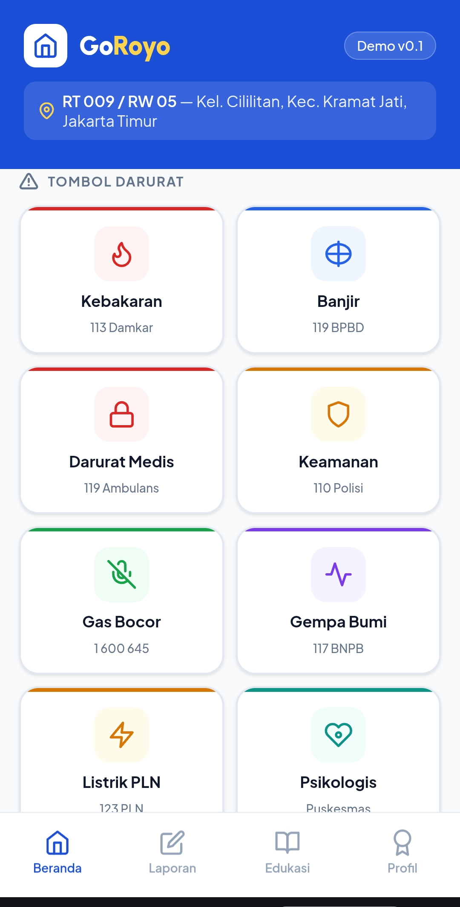
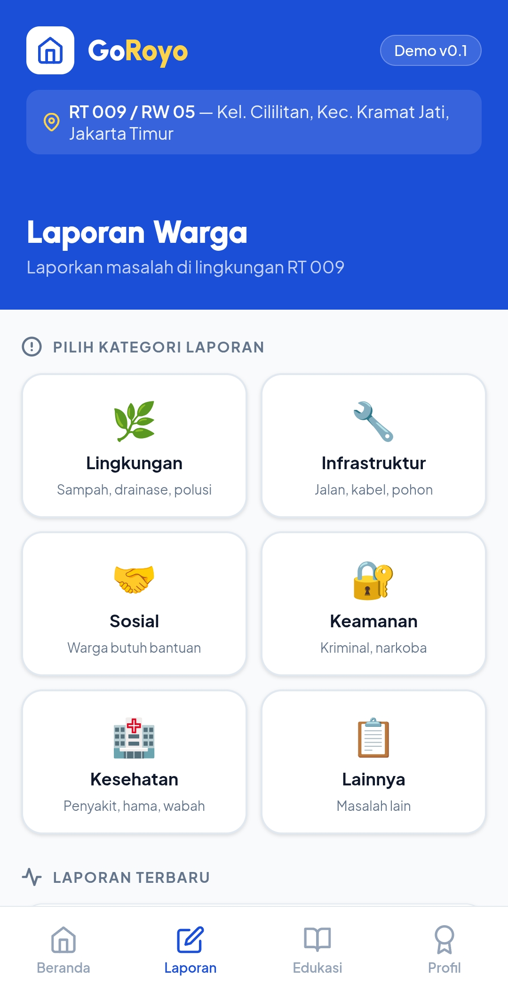
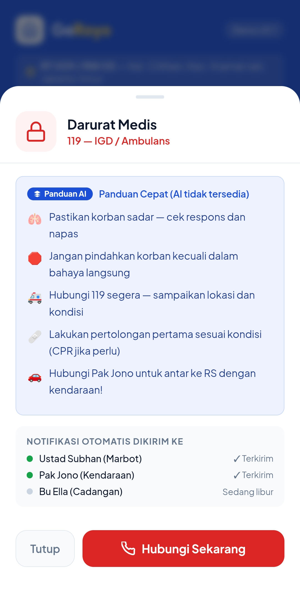
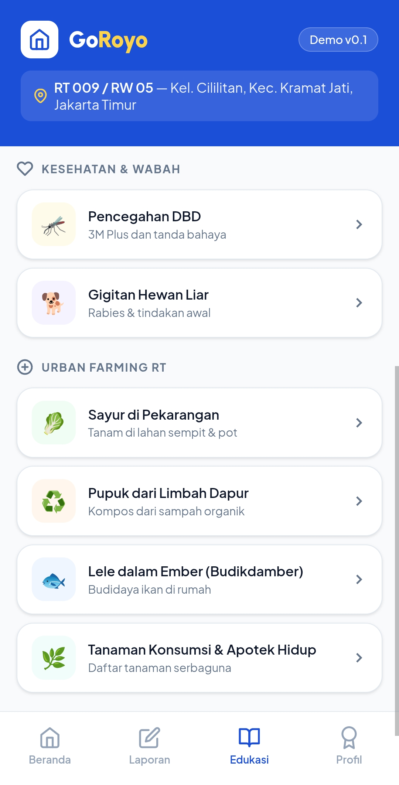
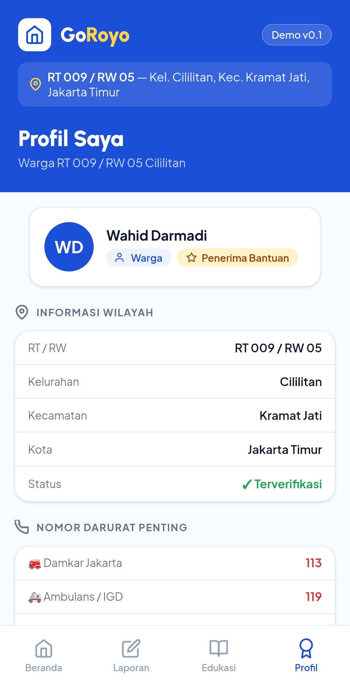

# GoRoyo — Sistem Tanggap Cepat Berbasis Warga

> **"Dari warga, untuk warga. Gotong royong dalam genggaman."**


🌐 **Live Demo:** [nginx-app-596656023692.asia-southeast2.run.app](https://nginx-app-596656023692.asia-southeast2.run.app)
🎬 **Video Demo:** [Tonton di YouTube](https://www.youtube.com/shorts/dJs5hwXzc0Q)

---

## 📸 Screenshots

| Beranda | Laporan Warga | Panduan AI |
|:-------:|:-------------:|:----------:|
|  |  |  |

| Pusat Edukasi | Profil & Nomor Darurat |
|:-------------:|:----------------------:|
|  |  |

---

## ⚠️ Catatan Penting

> **Ini adalah demo konsep** yang dibuat untuk kompetisi **#JuaraVibeCoding by Google**.
>
> Aplikasi ini mendemonstrasikan visi dan alur kerja GoRoyo dalam bentuk prototype interaktif satu halaman. **Pengembangan full app** membutuhkan waktu yang lebih panjang, tim pengembang, infrastruktur backend, dan investasi yang lebih besar.
>
> Data petugas, nomor RT/RW, dan informasi warga yang tampil bersifat **ilustratif** dan bukan data nyata.

---

## Tentang GoRoyo

**GoRoyo** (singkatan dari **Gotong Royong**) adalah konsep platform tanggap darurat berbasis komunitas RT/RW Indonesia. Terinspirasi dari nilai gotong royong dan pengalaman nyata kerja di lapangan mitigasi bencana bersama PMI.

### Masalah yang Coba Diselesaikan
- Warga kesulitan menghubungi petugas lokal saat darurat
- Tidak ada panduan cepat yang kontekstual saat bencana terjadi
- Informasi pengumuman RT/RW tersebar tidak terstruktur
- Koordinasi petugas siskamling masih manual dan lambat
- Minimnya edukasi siaga bencana di level komunitas

### Solusi
Tombol darurat satu ketuk → panduan AI kontekstual via Gemini → notifikasi petugas lokal → edukasi offline → laporan warga → info komunitas RT/RW.

---

## Fitur Demo (MVP)

| Fitur | Deskripsi |
|-------|-----------|
| 🔴 **Tombol Darurat** | 8 kategori: Kebakaran, Banjir, Medis, Keamanan, Gas Bocor, Gempa, Listrik PLN, Konsultasi Psikologis |
| 🤖 **Panduan AI** | Gemini 2.0 Flash generate panduan kontekstual berdasarkan jenis darurat & waktu kejadian |
| 👮 **Petugas Siaga** | Status shift & kontak langsung 3 petugas siskamling |
| 📢 **Pengumuman** | Papan informasi RT/RW dengan kategori |
| 📋 **Laporan Warga** | Form laporan 6 kategori (anonim/terbuka) dengan riwayat laporan |
| 📚 **Pusat Edukasi** | 34 panduan lengkap dalam 6 kategori — searchable, offline-ready |
| 🆘 **Mitigasi Bencana** | Kebakaran, Banjir, Gempa, Longsor, Tsunami, Banjir Rob, Kekeringan |
| 🩺 **Pertolongan Pertama** | CPR, APAR, luka, tenggelam, kejang, demam, epilepsi, diare, ibu hamil |
| 🧠 **Kesehatan & Wabah** | DBD, rabies, sampah, rokok & thirdhand smoke, baby blues, gangguan jiwa |
| 🌱 **Urban Farming RT** | Sayur, kompos, budikdamber lele, apotek hidup, ayam, sayuran liar |
| 🤝 **Sosial & Perlindungan** | Krisis jiwa & bunuh diri, KDRT, bullying, warga terlantar, PHK, disabilitas |
| 🐍 **Wabah & Hama** | Tikus, rayap, ular, kucing liar & dampak overfeeding |
| 📞 **Nomor Darurat Lengkap** | 12 nomor: Damkar, IGD, Polisi, BPBD, BNPB, PLN, PMI, Puskesmas, RSUD, BLK, Kelurahan, Kecamatan |
| 👤 **Profil Warga** | Info RT/RW, status verifikasi, badge penerima bantuan |
| 📱 **Mobile-friendly** | Responsif untuk HP, dioptimalkan untuk penggunaan satu tangan |

---

## Teknologi

```
Frontend   : HTML5 + CSS3 + Vanilla JavaScript (single file, no framework)
AI         : Google Gemini 2.0 Flash API (via Google AI Studio)
Server     : Nginx (Alpine)
Container  : Docker
Deploy     : Google Cloud Run (asia-southeast2 / Jakarta)
Font       : Plus Jakarta Sans + Urbanist (Google Fonts)
```

---

## Cara Menjalankan Secara Lokal

### Opsi 1 — Buka langsung di browser
```bash
# Clone repo
git clone https://github.com/whddarmadi/goroyo.git
cd goroyo

# Buka di browser (Windows)
start index.html

# Buka di browser (Mac)
open index.html
```

### Opsi 2 — Pakai Docker (sama seperti di Cloud Run)
```bash
docker build -t goroyo .
docker run -p 8080:8080 goroyo
# Buka http://localhost:8080
```

### Aktifkan Fitur AI (Opsional tapi Direkomendasikan)
1. Kunjungi [aistudio.google.com](https://aistudio.google.com)
2. Login dengan akun Google → klik **"Get API Key"** → **"Create API key"**
3. Salin API key (format: `AIzaSy...`)
4. Masukkan di banner kuning dalam aplikasi → klik **Simpan**
5. Setiap tombol darurat sekarang menghasilkan panduan AI yang kontekstual berdasarkan waktu kejadian!

> Tanpa API key, panduan statis offline tetap tersedia untuk semua kategori darurat.

---

## Deploy ke Google Cloud Run

### Prasyarat
- Akun Google Cloud dengan billing aktif / kredit JuaraVibeCoding
- Docker terinstall di komputer
- Google Cloud CLI (`gcloud`) terinstall

### Langkah Deploy

**1. Login dan setup project**
```bash
gcloud auth login
gcloud config set project YOUR_PROJECT_ID
```
> Cek Project ID di [console.cloud.google.com](https://console.cloud.google.com) — pojok kiri atas

**2. Aktifkan layanan yang dibutuhkan**
```bash
gcloud services enable run.googleapis.com
gcloud services enable containerregistry.googleapis.com
```

**3. Build dan push Docker image**
```bash
# Ganti YOUR_PROJECT_ID dengan project ID kamu
docker build -t gcr.io/YOUR_PROJECT_ID/goroyo .
docker push gcr.io/YOUR_PROJECT_ID/goroyo
```

**4. Deploy ke Cloud Run**
```bash
gcloud run deploy goroyo \
  --image gcr.io/YOUR_PROJECT_ID/goroyo \
  --platform managed \
  --region asia-southeast2 \
  --allow-unauthenticated \
  --port 8080 \
  --memory 256Mi
```

## Struktur Folder

```
goroyo/
├── assets/
│   ├── Home.jpeg              ← Screenshot tab Beranda
│   ├── Report.jpeg            ← Screenshot tab Laporan Warga
│   ├── Emergency_Button.jpeg  ← Screenshot modal panduan AI
│   ├── Education.jpeg         ← Screenshot tab Edukasi
│   └── Profile.jpeg           ← Screenshot tab Profil
├── index.html       ← Aplikasi utama (single-file PWA)
├── Dockerfile       ← Container config untuk Cloud Run
├── nginx.conf       ← Web server config (port 8080)
├── deploy.sh        ← Script deploy otomatis
├── README.md        ← Dokumentasi ini
└── .gitignore
```

---

## Roadmap Pengembangan (Full App)

### MVP Lanjutan (3–6 bulan)
- [ ] Sistem autentikasi warga & petugas (role: warga / petugas / RT-RW / admin)
- [ ] Push notification real ke HP petugas (Firebase Cloud Messaging)
- [ ] Laporan warga tersimpan ke database (Firebase Firestore)
- [ ] Chat assistant berbasis keyword retrieval (offline-first, tanpa LLM)
- [ ] Peta mitigasi bencana (OpenStreetMap + Leaflet)

### V2 — Modul Sosial & Pemberdayaan (6–12 bulan)
- [ ] Edukasi ODHA & Penyakit Menular Seksual — stigma & cara memperlakukan dengan benar
- [ ] Edukasi seksual untuk orang tua & remaja — pencegahan pergaulan bebas berbasis nilai
- [ ] Tips membangun UMKM dari nol — modal kecil, pasar lokal RT/RW
- [ ] Investasi aman & pemberdayaan kas RT/Masjid untuk pembiayaan UMKM warga
- [ ] Edukasi menghadapi kejahatan kriminal: pencurian, perampokan, pelecehan seksual
- [ ] Panduan lengkap disabilitas & inklusi sosial di komunitas
- [ ] Transparansi keuangan RT/RW (iuran, CSR, hibah)
- [ ] Sistem shift & manajemen jadwal petugas siskamling
- [ ] Early Warning System (integrasi BMKG real-time)
- [ ] Mode Krisis (UI darurat otomatis saat bencana besar)
- [ ] Gamifikasi petugas (badge & reward digital)

### V3 — Ekosistem Digital RT/RW (12+ bulan)
- [x] ~~Sistem ketahanan pangan RT (kebun, kolam lele, urban farming)~~ ✅ Sudah ada di Pusat Edukasi
- [ ] Dashboard statistik RT/RW untuk pengambilan keputusan ketua RT
- [ ] Sinkronisasi lintas RW & kelurahan
- [ ] Integrasi resmi BNPB, PMI, Basarnas untuk konten edukasi terverifikasi
- [ ] AI offline ringan untuk klasifikasi laporan warga
- [ ] Program beasiswa & bantuan perlengkapan sekolah berbasis kas RT
- [ ] Direktori UMKM warga RT — marketplace hyperlocal
- [ ] Sistem peringatan dini wabah penyakit berbasis laporan warga

---

## Estimasi Biaya (Pilot Kecil, 1 RT)

| Komponen | Biaya |
|----------|-------|
| Google Cloud Run (traffic rendah) | Gratis (free tier) |
| Firebase Spark Plan | Gratis |
| Gemini API (kuota gratis) | Gratis |
| OpenStreetMap + Leaflet | Gratis |
| **Total pilot awal** | **~Rp 0/bulan** |

Biaya mulai muncul saat scaling ke ratusan RT atau menggunakan SMS gateway dan fitur AI intensif.

---

## Arsitektur Full App (Konsep)

```
┌─────────────────────────────────────────────┐
│              GoRoyo App (PWA)               │
├─────────────┬───────────────┬───────────────┤
│   Warga     │   Petugas     │   RT/RW Admin │
│  Darurat,   │  Dashboard,   │  Pengumuman,  │
│  Laporan,   │  Status,      │  Keuangan,    │
│  Edukasi    │  Respon       │  Statistik    │
└─────────────┴───────────────┴───────────────┘
                     │
         ┌───────────┴───────────┐
         ▼                       ▼
┌─────────────────┐   ┌─────────────────────┐
│ Firebase Backend│   │   Offline-First     │
│ Firestore + FCM │   │ IndexedDB + Cache   │
│ Auth + Hosting  │   │ Knowledge Base PDF  │
└─────────────────┘   └─────────────────────┘
         │
         ▼
┌─────────────────────────────────────────────┐
│           AI Layer (Optional)               │
│  Gemini API │ Rule Engine │ Keyword Search  │
└─────────────────────────────────────────────┘
```

---

## 🏆 GoRoyo & Kriteria JuaraVibeCoding

### 1. Masalah (30%) — Nyata, Lokal, Mendesak

**Target Audiens:** Warga RT/RW Indonesia — khususnya mereka yang tinggal di kawasan padat urban dengan akses informasi darurat yang minim dan koordinasi komunitas yang masih manual.

**Mengapa penting sekarang?** Indonesia adalah salah satu negara paling rawan bencana di dunia. Namun di level RT/RW — unit terkecil masyarakat — belum ada sistem tanggap darurat yang terstruktur. Saat kebakaran atau banjir terjadi, warga masih mengandalkan teriakan dan grup WhatsApp.

**Dampak & Skalabilitas:** GoRoyo dirancang hyperlocal tapi dapat direplikasi ke seluruh RT/RW Indonesia (±80 juta kepala keluarga) tanpa perubahan infrastruktur besar — cukup ganti data lokasi dan petugas.

---

### 2. Solusi (40%) — Fungsional, Profesional, Delightful

**UX:** Single-tap emergency response — tidak ada login, tidak ada onboarding panjang. Warga ketuk tombol, panduan langsung muncul. Dirancang untuk digunakan satu tangan, dalam kondisi panik sekalipun.

**Value Proposition terukur:**
- ⚡ 0 detik loading — offline-first, panduan statis selalu tersedia
- 🤖 Panduan AI kontekstual berdasarkan waktu kejadian (pagi/malam beda panduan)
- 📚 34 panduan edukasi dalam 6 kategori — dari CPR hingga baby blues & urban farming
- 📞 12 nomor darurat langsung bisa ditekan dari satu halaman
- 🌱 Ketahanan pangan komunitas sebagai bagian dari tanggap bencana jangka panjang

---

### 3. Keunikan (30%) — The Spark

**Orisinalitas:** GoRoyo bukan sekadar app darurat. Ia adalah ekosistem ketahanan komunitas — menggabungkan respons bencana, kesehatan mental, ketahanan pangan, dan laporan warga dalam satu single HTML file tanpa framework apapun.

**Faktor "Wow":**
- Dibangun dalam 2 hari oleh seseorang berlatar belakang desain & multimedia — bukan developer
- Gemini 2.0 Flash digunakan bukan sekadar chatbot, tapi sebagai *contextual emergency guide* yang menyesuaikan respons berdasarkan jenis bencana dan waktu kejadian
- Terinspirasi dari pengalaman nyata sebagai relawan Mitigasi Bencana PMI — bukan sekadar ide di atas kertas
- Tombol konsultasi psikologis — satu-satunya app darurat RT/RW yang ingat bahwa bencana juga melukai mental warga

---

## Filosofi Desain

GoRoyo dibangun dengan prinsip:

- **Offline-first** — tetap berfungsi saat internet terbatas atau mati
- **Hyperlocal** — berbasis kondisi nyata RT/RW setempat
- **Lightweight** — berjalan di HP Android low-end sekalipun
- **Community-driven** — warga sebagai first responder, teknologi sebagai enabler
- **Manusiawi** — bukan sekadar app darurat, tapi ekosistem gotong royong digital

---

## Latar Belakang Pembuatan

Dibuat dengan semangat pengalaman nyata di lapangan:
- Latar belakang kerja di Mitigasi Bencana PMI
- Keprihatinan terhadap minimnya sistem tanggap darurat di level RT/RW Indonesia
- Keyakinan bahwa teknologi sederhana, lokal, dan manusiawi bisa menyelamatkan nyawa

---

## Kredit & Acknowledgment

- Konsep dikembangkan dengan bantuan AI (AI Studio, ChatGPT, Google Gemini, Claude)
- Panduan darurat mengacu pada standar PMI, BNPB, dan Kemenkes RI
- Dibuat untuk **#JuaraVibeCoding by Google** — event vibe coding komunitas Indonesia

---

## Lisensi

MIT License — bebas digunakan, dimodifikasi, dan dikembangkan untuk kepentingan komunitas.

---

*GoRoyo — Karena dalam kedaruratan, tetangga adalah ujung tombak pertolongan pertama.*

---

## 👤 Author

**[Wahid S. Darmadi]**
- GitHub: [@whddarmadi](https://github.com/whddarmadi)
- LinkedIn: [linkedin.com/in/whddarmadi](https://linkedin.com/in/whddarmadi)
- Instagram: [@wahwahcreative](https://www.instagram.com/wahwahcreative/)

---